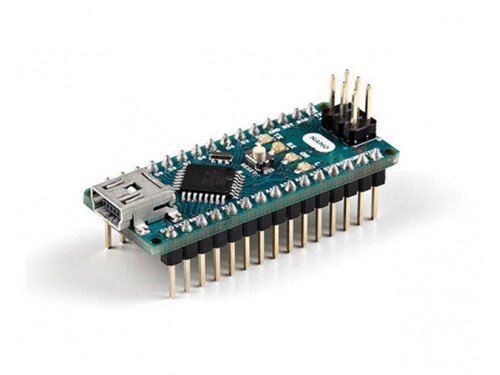
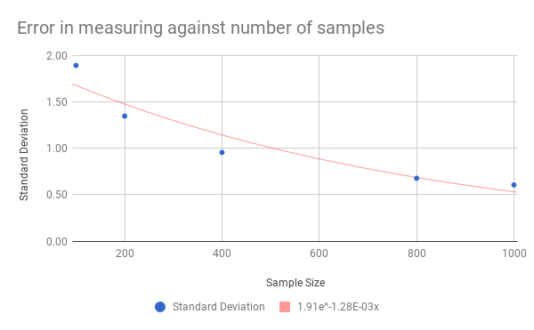
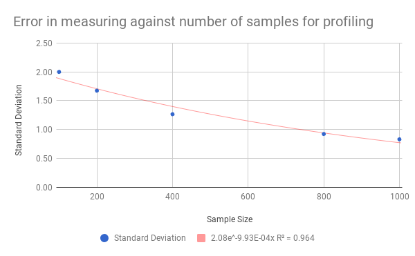
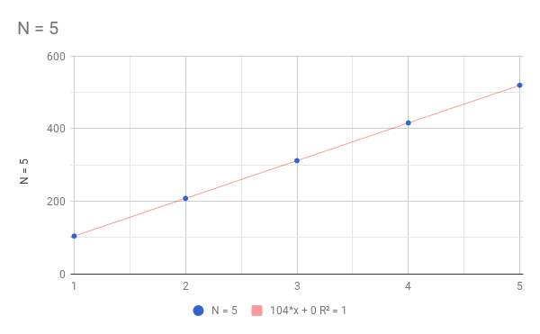
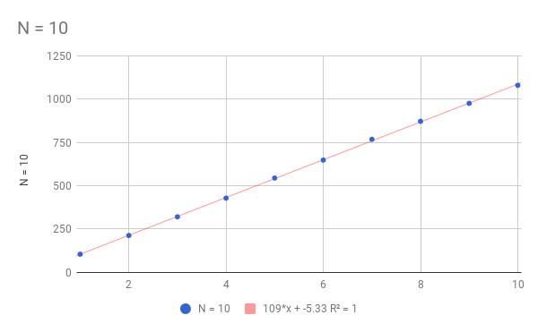
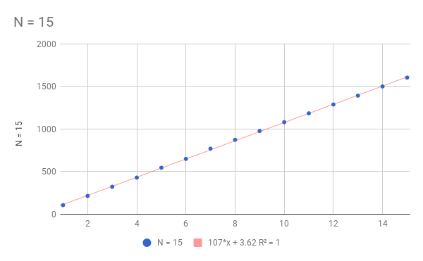
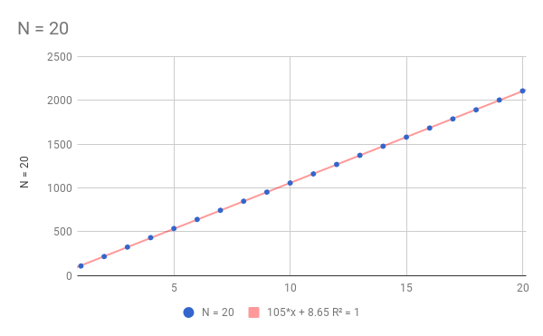
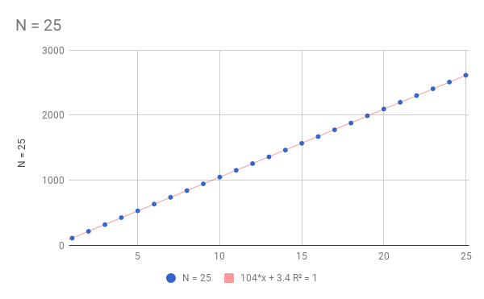

# executionTimeMeasurement

All of these experiments are performed in accordance with the paper titled *"Accurate Measurement of Small Execution Times – Getting Around Measurement Errors"*, can be downloaded from [here](https://uwaterloo.ca/embedded-software-group/publications/accurate-measurement-small-execution-times-getting-around).

>This repository is mercurial in nature, and constantly getting updated with new results.

**Test Hardware**

For deriving following result I've used Arduino Nano, running at 16MHz crystal. The board is powered by USB from a computer.



* Controller: Atmega328
* Operating Voltage : 5V
* Flash Memory : 32 KB of which 2 KB used by bootloader

**Test Function**

The function used to do aforementioned test is the ```delayMicroseconds(100);``` in Arduino environment, which halts the execution for microsecond(s) value passed.

>*Note: The testing hardware and function under the test is same, unless mentioned as the caption to the graph or method.*

## Simple Average method

This method is the conventional mitigation technique for minimising the measurement errors. The method involves repeated number if execution or the fragment under test, say we have iterated the measurement N times the the result is equal to total time calculated/N.

The above mentioned statement can be vividly demonstrated in the following pseudocode.

**Pseudocode**

```
repeat N time:
  a = get_time();
  delay(100us);
  b = get_time()
  executionTime = b - a;
end repeat

```

Following are the result of the experiment,

| Samples Taken | Avg. Execution Time   | Standard Deviation  |
| -------------:|:---------------------:| -------------------:|
| 100           | 104.36                | 1.89                |
| 200           | 104.18                | 1.35                |
| 400           | 104.09                | 0.96                |
| 800           | 104.045               | 0.68                |
| 1000          | 104.036               | 0.61                |

Following graph is plotted using the readings above,



We can vividly conclude that with the more number of samples, error value plunges.

**Time reading function profiling**

In conventional mitigation methods, we have to know the time taken by subordinate functions which we are using along with the function in measurement, the process is called as profiling. I've used ```micros();``` function to read the timing.

It has been observed that the time taken by the ```micros();``` function is about 4 microseconds; the same can be observed in the following table and graph.

| Sample Size	| Execution Time	| Standard Deviation |
|--:|--:|--:|
|100|	5.8|	2.00|
|200|	4.90|	1.67|
|400|	4.45|	1.27|
|800|	4.225|	0.92|
|1000|	4.18|	0.83|

Following graph is plotted using the readings above,



From above two tables we can have conclude that, execution of the ```delayMicroseconds(100);``` is 104.036 - 4.18 = 99.85 i.e. **99.85 microseconds**. We can approximate it to 100 microseconds.

## Straight Line Fitting

This method gives the  result with the less number of repetition when compared to the previous methods namely differential method and averaging method.

As well this is more robust as this involves the finding best fit straight line whose slope defines the execution time.

**Pseudo Code**

```
repeat N time:
  a = get_time();
  delay(100us);
  b = get_time();
  totalElapsedTime += b - a;
end repeat
```
The graph of ```totalElapsedTime``` is plotted against the number of iteration.

Following are the result of the measurement taken,

**Sample Size = N = 5**



* Equation: y = 104x + 0
* Slope: 104

**Sample Size = N = 10**



* Equation: y = 109x - 5.33
* Slope: 109

**Sample Size = N = 15**



* Equation: y = 107x + 3.62
* Slope: 107

**Sample Size = N = 20**



* Equation: y = 105x + 8.65
* Slope: 105

**Sample Size = N = 25**



* Equation: y = 104x + 3.4
* Slope: 104
